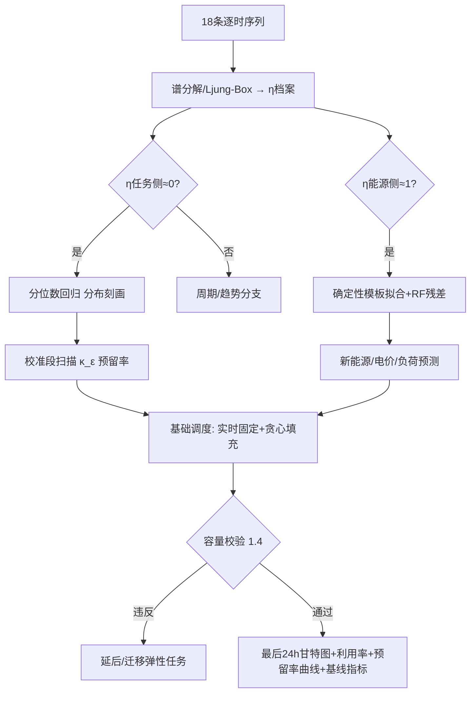
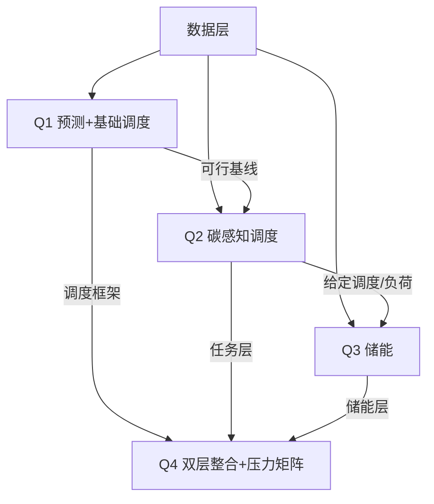

# 2026 华数杯 C题 — 完整数学模型详细实施方案

> 版本: v2.0（重写版，沉淀选题以来全部建模讨论：逐句解析/数据证据链/数理推导/实验设计/消融体系）
> 目标定位: 国家级一等奖冲刺（模型创新性 / 代码可执行性 / 结果可视化 / 论文写作素材）
> 配套文档: PLAN.md（作战概要）/ docs/（logs·sums·specs）/ Reference/（CONSTITUTION·INDEX）

## 目录
1. 项目概览与全局符号表
2. 题目深度解析（逐句级）
3. 数据侦察与证据链 D1-D9
4. 核心建模哲学与发现叙事
5. 预测系统设计（全题地基）
6. Q1 完整模型：证据链 + 分层预测 + 基础调度
7. Q2 完整模型：碳感知多目标调度（构造→进化→规则）
8. Q3 完整模型：储能协同优化（确定性 LP + 随机 MPC）
9. Q4 完整模型：多区域算-储-电协同整合（双层规划）
10. 方案分析与契合度自检（决策记录）
11. 实验设计总表
12. 消融体系 A-J
13. 工程规范与代码规划
14. 里程碑与检查点
15. 风险与缓解
16. 环境与依赖清单
附录 A: 全局参数表
附录 B: 数据字典（6 表逐字段）
附录 C: 附件1 口径公式速查
附录 D: 消融矩阵细化
附录 E: 全题依赖 DAG
附录 F: 变更记录

---

## 1. 项目概览与全局符号表

### 1.1 题目简述
2026 华数杯 C 题：面向算电协同的多目标调度优化研究。六个典型区域（A/B/C 东部高负荷、D 西部算力中心、E 光伏、F 风电）构成"算-储-电"耦合系统；任务三类（实时推理/批量推理/AI 训练）在 0-2399h 到达，2400-2405 结清末端任务，2406 电力与储能终态结算。需完成：Q1 统计+预测+基础调度；Q2 碳感知任务调度（迁移+开工时段）；Q3 储能协同优化；Q4 多区域整合模型与多场景对比。

### 1.2 小问速览
| 小问 | 直接目标 | 隐含目标/评审点 |
|---|---|---|
| Q1 | 18 序列统计分析 + 短期预测（三段切分）+ 基础调度 + 最后 24h 甘特图/利用率 | 预测按 0-2351/2352-2375/2376-2399 严格切分防泄露；调度输入=实际到达任务（预测只评自己）；基础调度=可行解构造，是 Q2 锚点 |
| Q2 | 碳感知调度：迁移+开工时段为决策变量，四目标（成本/碳排/时延/新能源利用率） | 多目标权衡机制；实时任务无弹性可预固定；时延白名单约束迁移；与 Q1 对比展示增益；输出可解释"调度策略" |
| Q3 | 储能充放电策略 + 对成本/碳排/峰值净购电/负荷波动的影响 | 只优化储能/购售电/新能源（任务固定）；SOC(2406)≥Initial；核心抓手=午间弃电充电；四指标 vs 基线对比 |
| Q4 | 多区域算-储-电整合模型 + 六指标权衡 + 三组场景对比 | 整合 Q2×Q3；"服务质量"自定口径；场景自造（碳限额/峰谷比/波动±30%）；鲁棒性结论 |

### 1.3 全局符号表
| 符号 | 含义 | 类型/单位 | 范围/取值 |
|---|---|---|---|
| R | 区域集合 | 索引 | {RegionA..F}，\|R\|=6 |
| T | 主时域 | 索引/小时 | 0..2399，粒度 1h |
| U | 收尾时域 | 索引/小时 | 2400..2405 |
| τ₀ | 终态结算时点 | 小时 | 2406 |
| J | 任务集合 | 索引 | \|J\|=50,000 |
| k_i | 任务类型 | 离散 | RT/BI/AT（实时/批量/训练） |
| s_i | 来源区域 | 离散 | R |
| a_i | 到达小时 | 小时 | 0..2399 |
| g_i | GPU 需求量 | 离散/等效GPU | 整数 1..127 |
| d_i | 执行时长 | 连续/小时 | 0.17..6.65（10-399min） |
| l_i | 最晚完成时点 | 小时 | ≤2406 |
| m_i | 最大可接受时延 | 连续/ms | RT=20, BI=80, AT=150 |
| C_r | 可用 GPU 容量 | 离散/GPU | A630 B585 C540 D1472 E1012 F966 |
| ρ_r | PUE | 无量纲 | A/B=1.35, C=1.38, D/E/F≈1.32-1.34（查 GPU_information） |
| L(s,r) | 单向时延 | 连续/ms | 5..82 |
| P_k | 单位 GPU 功率 | 连续/MW | RT=0.08, BI=0.10, AT=0.16 |
| λ(r,t) | 购电价 | 连续/元/MWh | 逐时（标签内波动±10-20%） |
| λ_s(r,t) | 售电价 | 连续/元/MWh | E/F>0，A-D=0 |
| c(r,t) | 碳强度 | 连续/tCO₂/MWh | 东部≈0.55-0.62，西部 0.22-0.42 |
| W(r,t) | 可用新能源 | 连续/MW | 确定性模板 500-1100 |
| N(r,t) | NonAI 负荷 | 连续/MW | 日模式（凌晨峰） |
| ηc, ηd | 充/放电效率 | 无量纲 | 分区制: A/B/C=0.93/0.92, D/E/F=0.94/0.93（R3 修正） |
| SOC_r(t) | 储能荷电状态 | 连续/MWh | [MinSOC, Cap] |

---

## 2. 题目深度解析（逐句级）

### 2.1 逐句解析表（背景 / 核心问题 / 已知条件 / 约束条件）

#### 背景段
| 原文要点 | 类别 | 关键信息 |
|---|---|---|
| AI 算力扩张→电力成本成数据中心核心成本 | 背景 | 论文引言素材；"成本"贯穿 Q2-Q4 主线 |
| "算电协同"纳入国家级新基建（2026 政府工作报告） | 背景 | 政策引用（东数西算）支撑模型定位 |
| 西部新能源丰富电价低、东部近用户时延低 | 背景 | 核心权衡：成本/碳 ↓ vs 时延 ↑（Q2/Q4 多目标张力来源） |

#### 系统与时间设定段
| 原文要点 | 类别 | 关键信息 |
|---|---|---|
| 六区域角色划分 | 已知 | 区域角色→时延/电价/碳/容量天然分层（D 容量最大 1472） |
| 主时域 0-2399h，粒度 1h | 已知 | 决策时间骨架 |
| 2400-2405 仅结清末端任务 | 约束 | 75 个跨段任务（含 19 实时）在此结清并计入结算 |
| 2406 不产生/不安排任务，仅终态结算 | 约束 | SOC(2406) 检查时点；不得占用第 2406 小时 |
| 任务三类 + 实时到达即开工 | 约束 | 白名单三层（数据实证）；slack 1-7h ≈ 无弹性 |
| 批量/训练可延后但 2406 前完成 | 约束 | 弹性任务=错峰+迁移的调节对象 |
| 任务不可抢占/拆分/中途迁移 | 约束 | 每个任务=连续时间窗（区间调度/装箱结构） |

#### 问题 1（统计+预测+基础调度）
| 原文要点 | 类别 | 关键信息 |
|---|---|---|
| 不同区域不同类型 GPU 需求统计分析 | 核心问题 | 18 条逐时序列 + 分布特征 |
| 构建短期预测模型 | 核心问题 | 三段切分 0-2351/2352-2375/2376-2399（说明5） |
| 建立基础算力调度模型 | 核心问题 | 可行性优先，Q2 地基 |
| 2376-2399 实际到达任务调度方案 | 已知+核心 | 说明2：调度输入=实际到达任务，预测仅评自己 |
| 跨 2399 任务收尾时域结清 | 约束 | 75 个跨段任务（19 实时），收尾段全 Valley 电价 |
| 最后 24h 甘特图+区域 GPU 利用率 | 核心问题 | 可视化交付物（论文配图） |

#### 问题 2（碳感知调度）
| 原文要点 | 类别 | 关键信息 |
|---|---|---|
| 0-2399 实际到达任务+逐时电力参数为输入 | 已知 | 实际数据，不用预测值 |
| 考虑区域电价/碳强度/可用新能源 | 已知 | 电价段内逐时波动→决策对小时级敏感 |
| 决策变量=任务迁移+开工时段 | 核心问题 | 迁移可行域=白名单（结构化）；开工时段只对弹性任务有效 |
| 迁移后负荷按统一功率映射与 PUE 计算 | 约束（口径） | power_mapping 唯一口径 |
| 目标=成本/碳排/时延/新能源利用率 | 核心问题 | 4 目标多目标；西迁省钱碳但增时延 |
| 给出调度策略 | 隐含 | 可解释策略规则（何时迁/错峰到何时），非黑盒 |

#### 问题 3（储能）
| 原文要点 | 类别 | 关键信息 |
|---|---|---|
| 给定任务调度和逐时负荷 | 已知 | 说明4：用 Baseline_AI_IT + NonAI 作给定负荷，不重优化任务 |
| 设计储能充放电策略 | 核心问题 | 连续 LP（充放/购售电/新能源分配） |
| 分析对成本/碳排/峰值净购电/负荷波动的影响 | 核心+隐含 | 四指标 vs 基线；削峰对象是凌晨购电峰；弃电 775 万 MWh 是主抓手 |
| SOC 上下限/充放功率/效率/SOC(2406)≥Initial | 约束 | SOC 递推线性；终态防终点套利 |

#### 问题 4（整合）
| 原文要点 | 类别 | 关键信息 |
|---|---|---|
| 在前三问基础上建多区域算-储-电协同模型 | 核心问题 | 整合 Q2 任务层 + Q3 储能层 + 购售电边界 |
| 六指标权衡：成本/碳排/时延/服务质量/利用率/峰值 | 核心问题 | "服务质量"为新增指标，需自定口径 |
| 比较碳约束/电价机制/新能源波动场景 | 隐含 | 场景自造（数据只有一套参数）→ 鲁棒性/灵敏度分析 |
| 不要求建潮流/带宽/迁移数据量模型 | 约束（简化） | 别自找麻烦（说明7） |

#### 说明段 7 条 → 口径清单
| 条目 | 口径要点 | 落地影响 |
|---|---|---|
| 说明1 | 无单位字段已注明 | 数据字典唯一口径来源 |
| 说明2 | 2376-2399 预测精度仅用于评价；Q2-Q4 按实际数据重算 | 预测与调度解耦 |
| 说明3 | 调度须满足 GPU 容量/IT 功率/设施功率/时延/时限 | 硬约束全集 |
| 说明4 | Q3 用基线负荷，只优化储能/购售电/新能源 | Q3 边界 |
| 说明5 | InitialSOC 为第 0 小时前状态；SOC_MWh 为时段末；三段式切分 | 储能与预测时序口径 |
| 说明6 | Q2-Q4 主时域 0-2399；2400-2405 结清并结算；2406 终态 | 时间域边界 |
| 说明7 | Q4 不建潮流/带宽/迁移量模型 | 简化边界 |

### 2.2 题型分类与判断依据
| 小问 | 题型 | 判断依据 |
|---|---|---|
| Q1 | 预测类（时序）为主 + 优化类（可行解构造） | 明确"构建短期预测模型"+三段切分→时序预测；"基础调度"以满足容量/时延/时限的可行性为目标 |
| Q2 | 优化类（多目标） | 决策变量明确（迁移+开工时段）；四指标"目标或评价指标"→多目标权衡 |
| Q3 | 优化类（线性规划）+ 评价类（影响对比） | 连续变量+SOC 线性递推→LP；"分析影响"→vs 基线四指标对比 |
| Q4 | 优化类（多目标整合）+ 评价类（权衡）+ 情景分析 | "统一考虑……权衡"→多目标；"比较不同场景"→情景对比/鲁棒性 |
| 全题暗线 | 机理分析 | 功率平衡/SOC 递推/时延-迁移拓扑（附件1 公式即机理骨架） |

### 2.3 逻辑关系与条件依赖
```
数据与口径层（全题地基）
├── 任务侧: workload_trace + GPU_information + network_latency + power_mapping
├── 能源侧: region_time_data + storage_information
└── 口径: 附件1 统一公式
Q1 统计+预测+基础调度 ──(可行基线/锚点)──► Q2 碳感知调度 ──(给定调度/负荷)──► Q3 储能
Q1 ──(调度框架)──┐                                  Q3 ──(储能组件)──┐
                  ├─────────────────────────────────────────────────► Q4 整合
关键依赖链:
  时延矩阵 → 白名单 → Q2/Q4 可行域
  GPU容量+功率映射+PUE → 全程硬约束
  电价/碳/新能源 → Q2 目标系数 + Q3 功率平衡
  SOC递推+SOC(2406) → Q3/Q4 终态约束
  2376-2399 预测 ↔ 调度解耦（说明2）
```

---

## 3. 数据侦察与证据链 D1-D9

> 全部经代码实证（step0_loader/step0_eda），图见 figures/eda/figD1-D9，数字见 figures/eda/eda_summary.json

| # | 证据 | 实证数字 | 图 |
|---|---|---|---|
| D1 | 任务到达白噪声 | 18 序列 mean lag1=0.011 / lag24=-0.006；ACF 在 ±1.96/√n 带内；无日/周周期 | figD1 |
| D2 | 新能源模板化 | 六区曲线 100% 重合；day0==day1 严格日周期；范围 500-1100MW | figD2 |
| D3 | 本地执行超容 | E 30h / F 67h（最大超 62%）；A/B/C/D 仅 3-6h | figD3 |
| D4 | 弃电天文数字 | 总弃电 775.5 万 MWh；利用率 32.9%；弃电充电≈0（~20MW） | figD4 |
| D5 | 相位错位 | NonAI 负荷凌晨峰/傍晚谷差 67.4%；价格 Peak=17-21/Valley=0-6；光伏峰 10-14 | figD5 |
| D6 | 时延白名单三层 | RT 最少 1 区（D 孤立）、BI 最少 5 区（A 到不了 F）、AT 全 6 区 | figD6 |
| D7 | 电价标签内波动 | Flat 段 ±19.7%、Valley/Peak ±9.9%；全国同步时段标签 | figD7 |
| D8 | 实时推理无弹性 | slack 中位 4h（1-7h）；本地执行永无超容（已验证） | figD8 |
| D9 | 数据零脏 | 零 NaN、零矛盾任务（duration≤slack 全成立）、规格分布 1-127 GPU | figD9 |

### 3.1 新发现（侦察期未覆盖，已入 sum_1）
**东区弃电率 88-91%（A/B/C）远高于西区（39-53%）**：东区无外送能力（SellLimit=0）且负荷峰在凌晨与光伏白天出力错位 → 相位错位在东区直接转化为弃电损失。**储能（午间弃电充电）在东区价值比西区更显著**。

### 3.2 数据质量报告摘要（quality_report.json）
workload_nan=0 / region_time_nan=0 / contradict_tasks=0 / negative_slack=0 /
latest_finish>2406=0 / arrival_range=[0,2399] / 每区域 2407h / Main=14400 + Closure=42

---

## 4. 核心建模哲学与发现叙事

### 4.1 核心发现（论文摘要第一句的原料）
> **算电协同系统的本质 = 确定性结构提供套利空间 + 随机性结构定义鲁棒边界**。
负荷、价格、新能源三曲线之间存在系统性相位错位（凌晨谷价负荷峰、午间零成本弃电峰、傍晚高价谷），定义了全部确定性套利机会；任务到达的白噪声定义了鲁棒调度的边界。四个问题皆为这一原则的推论。

### 4.2 可预测性分层（η 档案）
| 层 | 对象 | 可预测性 | 预测策略 |
|---|---|---|---|
| 任务侧 | 18 条 GPU 需求序列 | η≈0（白噪声） | 分布刻画（分位数）+ 区间校准，放弃点预测幻想 |
| 能源侧 | 新能源/电价/碳强度/负荷 24 条 | η≈1（模板/标签/日模式） | 确定性结构拟合 + 残差修正，认真堆精度（MAPE 5-10%） |
| 决策侧 | 预留率 κ_ε | 由覆盖率校准决定 | 闭环反馈控制 |

### 4.3 基线缺陷清单 = 优化路线图
| 基线缺陷 | 对应机制 | 量化抓手 |
|---|---|---|
| 弃电不用（775 万 MWh） | 储能"免费能量"时空搬运 | 弃电 0 元/MWh vs 谷电 279-468 元/MWh |
| GPU 超容（E/F 67h） | 迁移 + 错峰 | 超容小时→0 |
| 任务不迁移（本地执行） | 白名单内迁往低价低碳区 | 东西部电价差 ≈45%、碳差 ≈60% |
| 谷充峰放但充不满 | 弃电充电替代谷电充电 | 峰谷价差 2.2×（A 区） |

### 4.4 E1 关键实验（全篇胜负手）
**完美预测 vs 分布调度 vs 基线 三方对照**：
若"完美预测调度"相对基线的收益与"分布调度"相对基线的收益差距 <5%，则证明：
1. 收益主驱动是结构套利（价格/碳/新能源的确定性时空差），而非预测精度
2. 白噪声下把算力投入复杂预测是负收益
3. 分布调度+预留闭环是任务侧的正确范式
E1 结论直接支撑论文叙事 + 指导"预留系数在线校准"落地参数。

---

## 5. 预测系统设计（全题地基）

### 5.1 预测对象（三层 42 条序列）
| 层 | 对象 | 条数 | 预测器主力 |
|---|---|---|---|
| 任务侧 | 逐时 GPU 需求（6 区×3 类型） | 18 | 历史分布 + QRF 分位数 + LGBM 分位数 |
| 任务侧 | 逐时到达数/规格分布 | 6+ | 泊松/负二项拟合 + 拟合优度检验 |
| 能源侧 | 新能源出力（6 区） | 6 | 正弦模板拟合 + RF 残差修正 |
| 能源侧 | 逐时电价（6 区） | 6 | 灰盒：标签均值 + RF 残差 |
| 能源侧 | 逐时碳强度（6 区） | 6 | 灰盒同上 |
| 能源侧 | NonAI 负荷（6 区） | 6 | 日模式分解 + RF |

### 5.1b 特征集 v1（feature-engineering 审查定稿，step1.1 实现时落代码）
| 特征族 | 成员 | 防泄露规则 |
|---|---|---|
| 日历 | hour_of_day / day_of_week / is_weekend / hour_sin / hour_cos（循环编码，23:00 与 00:00 相近） | 无（外生已知） |
| 价格结构 | PricePeriod 标签（Valley/Flat/Peak）、段内电价水平 | 外生已知（H1 假设：逐时参数为决策时刻已知输入） |
| 滞后 | 任务侧：lag1/lag24/lag168 及滚动窗口（24h 均值/std，shift≥1） | **强制 shift≥1，禁止 t 时刻用自身 target** |
| 偏态处理 | 任务侧 GPU 需求：QRF 分位数回归对单调变换不变，log1p 变换仅用于点预测模型（按 EDA figD9 分布定） | 变换 fit 在训练折内（Pipeline） |
| 交互 | 能源侧：可考虑的领域交互（如 负荷×PUE、可用新能源×时段）按 EDA 相关性再定 | 少而精（30-60 个），不堆千级特征 |

### 5.2 四家族竞技榜
| 家族 | 成员 | 角色 | 环境状态 |
|---|---|---|---|
| 统计基线 | 历史分布/ARIMA/滚动均值/泊松 | 及格线 + 兜底（永远在场） | ✅ statsmodels |
| 树类（主力） | QRF / LightGBM / XGBoost | 任务侧分布 + 能源侧残差 + 风险分类 | ✅ 全齐 |
| 深度 | TCN / LSTM（torch+GPU） | 能源侧长序列探测；任务侧预期过拟合崩（崩=论文证据） | ✅ RTX 5060 |
| 基础模型 | TabPFN 7.1.1 | 外部挑战者，不预设输赢 | ✅ 已装 |

### 5.3 类选验证门（硬规则，非人肉判断）
对每个预测对象：
1. 模型池训练（防泄露三段协议，见下）
2. 评估矩阵：对象×模型 → **分层指标**（见下）+ mean±std（内部多折）
3. 验证门：复杂模型须显著优于统计基线才入选——任务侧判据=覆盖率校准达标（<80%→≥90%）或 pinball loss 降幅≥5%；能源侧判据=MAPE 相对降幅≥5%
4. 入选模型 RF stacking 融合 → 融合增益消融（vs 最优单模型，无增益则回退）
5. 输出每对象"模型竞技榜"表 → 全篇类选结论

**防泄露三段协议**（model-evaluation 审查定稿）：
- 类选决策：0-2351 内部 **5 折滚动 CV**（TimeSeriesSplit，绝不 shuffle），报告 mean±std——单次验证的 0.2% 增益在噪声内不算增益
- 校准决策：2352-2375 仅做预留率 κ_ε 校准（覆盖率≈95%）
- 最终测试：2376-2399 完全冻结（final untouched test set），全部超参/类选/校准不可再触碰

**分层指标**（任务侧 vs 能源侧，防论文自毁）：
| 层 | 主指标（裁决用） | 报告指标 |
|---|---|---|
| 任务侧（白噪声） | 区间覆盖率（标称 90% 校准达标）+ 区间宽度（尖锐度）+ pinball loss | MAPE/RMSE（预期≈100%，仅报告不作裁决） |
| 能源侧（可预测） | MAPE / RMSE | 覆盖率（宽松参考） |

### 5.4 四层回退链（"模型跨了"的完整预案）
| 崩坏位置 | 检测信号 | 处置 |
|---|---|---|
| 训练期 | NaN loss/不收敛/异常 | 捕获→剔除出池→剩余模型接管 |
| 验证期 | 不如统计基线 | 验证门自动拒绝 |
| 推理期 | 分位数违序/区间宽度爆炸 | 合理性校验→回退历史分布 |
| 融合层 | stacking 失败/负增益 | stacking→等权→验证集最优单模型→统计基线 |

### 5.5 预留闭环（预测→调度的桥）
- QRF/LGBM 分位数 → q_α(t)（10/50/90）
- 预留率 κ_ε(t) = 1 − q_{1−ε}(t)/C_r（保证 1−ε 概率不超容）
- ε 由 2352-2375 调参段滚动校准（覆盖率≈95%），实际运行以最低容量代价换最高保障率

### 5.6 预期剧本（类选结论预告）
任务侧：树/深/基础模型全部被验证门拒绝（类选结论=白噪声，放弃点预测）；
能源侧：树类全胜统计基线（类选结论=强可预测，RF/LGBM 上场）。
两条结论均来自竞技榜数据，不是叙事。

---

## 6. Q1 完整模型：证据链 + 分层预测 + 基础调度

### 6.1 模型准备
输入：18 条逐时序列（series_gpu_demand.csv）、到达过程（series_arrivals.csv）、白名单表、容量参数。
前置产物：output/clean/ 全量。

### 6.2 变量定义表
| 类别 | 变量 | 类型/单位 | 约束范围 | 说明 |
|---|---|---|---|---|
| 决策 | x_{i,r} | 离散{0,1} | x≤1[L(s_i,r)≤m_i] | 任务 i 调度到 r |
| 决策 | st_i | 离散/小时 | st_i=a_i（RT）；a_i≤st_i≤l_i−d_i | 开工时段 |
| 决策 | κ_r(t) | 连续[0,1] | 调参段扫出 | 容量预留率 |
| 中间 | O_r(t) | 连续/GPU | ≥0 | 并行占用 |
| 中间 | u_r(t) | 连续[0,1] | 0-100% | GPU 利用率 |
| 目标 | Viol | 整数/小时 | ≥0 | 超容小时数（阶段1） |
| 目标 | Cost₁ | 连续/万元 | ≥0 | 购电成本（阶段2） |

### 6.3 核心假设
- H1.1 任务到达独立同分布（白噪声）——**待证据链验证**，拒绝则转周期/趋势分支
- H1.2 新能源出力为确定性日周期（数据实证 day0=day1）→ 预测退化为模板拟合

### 6.4 公式推导
**① 可预测性指标（证据链核心）**
```
η(Y) = 1 − Var(残差白噪声) / Var(Y)                     (1.1)
```
*物理意义：序列方差中可被确定性结构解释的比例；η→0 白噪声、η→1 完全可预测。*

**② 分布预测（任务侧，H1.1 成立时）**
```
q_α(t) = argmin_q E[ ρ_α(Y_{r,k}(t) − q) ]             (1.2)
```
ρ_α 为 pinball 损失。*物理意义：白噪声下点预测无信息增益，分布刻画是能拿到的全部信息。*

**③ 占用卷积（容量核算，说明3 口径）**
```
O_r(t) = Σ_i g_i · 1[x_{i,r}=1, st_i ≤ t < st_i + d_i]   (1.3)
```
*物理意义：任务 i 是长度为 d_i 的时间窗，占用量=各窗在 t 的重叠 GPU 之和。*

**④ 容量约束（含预留）**
```
O_r(t) ≤ (1 − κ_r(t)) · C_r,  ∀r,t                     (1.4)
```

**⑤ 预留-违反率权衡（H4 量化）**
```
κ_ε(t) = 1 − q_{1−ε}(t)/C_r                             (1.5)
```
*物理意义：保证 1−ε 概率不超容所需的最小容量代价；由调参段校准。*

**⑥ 基础调度目标（两阶段序贯）**
```
阶段1: min Viol = Σ_t 1[O_r(t) > (1−κ)C_r]              (1.6)
阶段2: min Cost₁ = Σ_{r,t} λ(r,t)·G(r,t)（新能源优先消纳后） (1.7)
```
优先级序贯：实时→批量→训练贪心填充（实时 st 固定，D8 实证）。

### 6.5 建模流程图


### 6.6 输出物
最后 24h 调度甘特图、区域 GPU 利用率、预留率曲线；基线指标（成本/碳排/利用率/超容小时）= 全篇对照锚点。

---

## 7. Q2 完整模型：碳感知多目标调度（构造→进化→规则）

### 7.1 三段式架构
```
构造层: 白名单 + 价差/碳差排序强启发式 → 初始可行解
进化层: NSGA-II（染色体=任务批迁移倾向+错峰偏移）→ 四目标评估 → 帕累托前沿
规则层: CART/关联规则 从前沿解集挖"调度策略"（题目要求的可解释交付物）
```

### 7.2 变量定义表
| 类别 | 变量 | 类型/单位 | 范围 | 说明 |
|---|---|---|---|---|
| 决策 | x_{i,r} | 离散{0,1} | 白名单内 | 迁移分配 |
| 决策 | st_i | 离散/小时 | a_i≤st_i≤l_i−d_i | 开工时段（RT 固定） |
| 中间 | A(r,t) | 连续/MW | ≥0 | AI IT 负荷（2.1） |
| 中间 | D(r,t) | 连续/MW | ≤设施上限 | 设施负荷（2.2） |
| 中间 | G(r,t) | 连续/MW | ≥0 | 购电（无储能） |
| 中间 | W_used(r,t) | 连续/MW | ≤W(r,t) | 新能源消纳 |
| 中间 | ω_i | 连续/ms | ≥0 | 任务时延（2.7） |
| 目标 | Cost₂/CE₂/Lat/NU | 连续 | — | 四目标向量 |

### 7.3 核心假设
- H2.1 无储能参与（储能留待 Q3）→ 功率平衡 G + W_used = D
- H2.2 迁移即时无延迟开销（说明7 忽略迁移数据量与传输）
- H2.3 新能源优先消纳原则（免费能源先于购电）

### 7.4 公式推导
**① AI IT 负荷（附件1 唯一口径）**
```
A(r,t) = Σ_i g_i·P_{k_i}·1[x_{i,r}=1, st_i ≤ t < st_i+d_i]     (2.1)
```
**② 设施负荷**
```
D(r,t) = [N(r,t) + A(r,t)] · ρ_r                             (2.2)
```
**③ 功率平衡与购电（无储能）**
```
G(r,t) = max(0, D(r,t) − W_used(r,t)),  W_used ≤ W(r,t)       (2.3)
```
**④ 运行成本**
```
Cost₂ = Σ_{r,t} λ(r,t)·G(r,t) − Σ_{r,t} λ_s(r,t)·S(r,t)       (2.4)
```
（Q2 简化：A-D 无外送 S=0；E/F 富余外送 S≤SellLimit）
**⑤ 碳排放**
```
CE₂ = Σ_{r,t} c(r,t)·G(r,t)                                   (2.5)
```
**⑥ 新能源利用率**
```
NU = Σ W_used / Σ W(r,t)                                      (2.6)
```
**⑦ 网络时延（GPU-hours 加权平均）**
```
ω_i = L(s_i, r·x_i)； Lat = Σ_i ω_i·g_i·d_i / Σ_i g_i·d_i      (2.7)
```
**⑧ 多目标形式化**
```
min [Cost₂, CE₂, Lat, 1−NU]ᵀ
s.t. (2.1)-(2.3)；O_r(t)≤C_r；st_i+d_i≤l_i；st_i=a_i(RT)；白名单
```
求解：ε-约束/加权和（熵权法定权）+ NSGA-II 帕累托前沿 + CART 规则提取。

### 7.5 时延目标形式研究点（深入探讨点）
| 变体 | 形式 | 含义 |
|---|---|---|
| T1 纯加权 | Lat = Σω_i·g_i·d_i/Σg_i·d_i | 总量视角 |
| T2 纯违约惩罚 | Lat' = Σ_i P·1[ω_i>m_i] | SLA 视角 |
| T3 混合 | Lat* = (1−θ)·Lat + θ·(Lat + β·违约数/任务数) | 总量+违约双通道 |

**两阶段扫描**（计算预算控制）：
- Phase1：固定 α=0.5 扫 θ×β 网格（θ∈{0,0.3,0.5,0.7,1}×β∈{1,5,10}）→ 找 θ 稳健区间（折中解几乎不动的区间）
- Phase2：在 θ 稳健区间内做 α×θ 混合扫描
- 输出：帕累托前沿对比 + 违约率-时延曲线，数据裁决最优形式

### 7.6 NSGA-II 编码设计
- 染色体：任务批（按规格聚类至 ~500 批）的迁移倾向 + 错峰偏移
- 评估器：下层滚动 24h 窗口错峰贪心 + 容量修复算子（超容→延后/回迁）
- 目标：四指标向量；非支配排序 + 拥挤度
- 可复现性：小种群（50-80）+ 中代数（100-200），结果稳定

### 7.7 规则提取（题目要的"调度策略"）
对帕累托解集拟合 CART 决策树/关联规则 → 输出人读运营规则，如：
"若 D 区谷价 < 300 元/MWh 且训练批 ≥50 GPU 且时延裕度 ≥60ms → 迁移至 D 并延后到 Valley"

### 7.8 帕累托决策系统
前沿 + 熵权 TOPSIS 折中解 + 每目标边际效益曲线（如"多付 1% 成本，碳排降多少"）。

### 7.9 baseline_proof
vs 附件基线 + 本地执行基线 → 改进率统计表（防自嗨，数字可追溯）。

---

## 8. Q3 完整模型：储能协同优化（确定性 LP + 随机 MPC）

### 8.1 给定负荷口径（说明4）
IT 负荷 = Baseline_AI_IT_Load + NonAI_IT_Load（给定）；设施负荷 = IT × PUE。
只优化：储能充放电、购售电、新能源分配。

### 8.2 变量定义表
| 类别 | 变量 | 类型/单位 | 范围 | 说明 |
|---|---|---|---|---|
| 决策 | Pc(r,t), Pd(r,t) | 连续/MW | [0,MaxC]/[0,MaxD] | 充/放电 |
| 决策 | G(r,t) | 连续/MW | [0,MaxImport] | 购电 |
| 决策 | S(r,t) | 连续/MW | [0,min(SellLimit,MaxExport)] | 外送/售电 |
| 决策 | W_used(r,t), Q(r,t) | 连续/MW | W_used+Q≤W | 消纳/弃电 |
| 状态 | SOC(r,t) | 连续/MWh | [MinSOC,Cap] | 时段末 SOC |
| 目标 | Cost₃/CE₃/P_peak/Vol | 连续 | — | 四指标 |

### 8.3 核心假设
- H3.1 SOC 线性递推（效率常数化，附件1 口径即线性）
- H3.2 储能不跨区域调运（区域独立，storage_information 为区域级）
- H3.3 随机模型下新能源为场景树（确定性均值+AR(1) 扰动，自造场景）

### 8.4 公式推导
**① 功率平衡（区域-小时，附件1）**
```
G + W_used + Pd = D + Pc + S + Q                            (3.1)
```
*物理意义：供给侧（购电+新能源+放电）与需求侧（负荷+充电+外送+弃电）每小时平衡；Q 为松弛变量（弃电=浪费，目标惩罚）。*
**② SOC 递推**
```
SOC(r,t) = SOC(r,t−1) + ηc·Pc(r,t) − Pd(r,t)/ηd             (3.2)
```
**③ 终态与边界**
```
SOC(r,2406) ≥ InitialSOC(r)                                 (3.3)
MinSOC ≤ SOC(r,t) ≤ Cap(r)                                  (3.4)
```
*物理意义：3.3 防终点套利；3.4 安全运行域。*
**④ 确定性 LP 目标（基准）**
```
min Cost₃ = Σ λ·G − Σ λ_s·S
s.t. (3.1)-(3.4) + 充放功率上限 + 购售电边界
```
*物理意义：线性结构精确求解（pulp/CBC）；弃电成本 0 而购电为正 → 模型自动学到"弃电优先充电"。*
**⑤ 随机 MPC 主模型（滚动 24h，场景 ω∈Ω）**
```
min Σ_ω p_ω·[ Σ_{t∈W} λ(t)·G_ω(t) − λ_s(t)·S_ω(t) ]
s.t. ∀ω: (3.1)-(3.4)；首时段决策执行后滚动
```
*物理意义：期望成本最小化 + 场景内逐条约束 → 对波动鲁棒；仅执行首时段 → 反馈闭环。*
**⑥ 影响指标**
```
P_peak = max_{r,t} [G(r,t) − S(r,t)]                        (3.5)
Vol    = std_t [G(r,t) − S(r,t)]                            (3.6)
CE₃    = Σ c(r,t)·G(r,t)                                    (3.7)
```
**⑦ Sobol 全局敏感性**
```
θ = (Cap, ηc, ηd, 电价水平, 波动σ) → Y = (Cost₃, CE₃, P_peak, Vol)
S1_j = Var(E[Y|θ_j])/Var(Y)；ST_j = 1 − Var(E[Y|θ_~j])/Var(Y)   (3.8)
```
*物理意义：一阶效应=参数独立贡献，总效应=含交互总贡献；SALib Saltelli 采样。*

### 8.5 波动双指标（主次并列报告）
- 净购电标准差：整体离散度（统计视角）
- **最大爬坡率** max|ΔG(t)|：相邻小时购电变化量（物理视角，调频/备用压力直接来源）
两个都算并报告，Sobol 对两指标分别归因。

### 8.6 场景生成
模板（确定性正弦）× (1+ε)，ε~AR(1)，σ∈{10%,20%,30%} → 场景树 + K-means 缩减至 8-16 个。

### 8.7 MPC 循环与对比
t=0..2406 滚动；LP vs MPC 对比曲线（波动率↑→MPC 优势↑）= 论文金图；对比时诚实声明扰动为自造场景（数据无波动），MPC 价值以方法论演示+鲁棒对比呈现。

---

## 9. Q4 完整模型：多区域算-储-电协同整合（双层规划）

### 9.1 双层结构
```
上层 NSGA-II（迁移 x_{i,r} + 错峰 st_i + α 伴随基因）  ← 离散
下层 LP（储能 Pc/Pd/G/S，给定上层任务）               ← 连续，精确求解
下层返回 Cost₃/CE₃/P_peak → 上层六目标分量
```

### 9.2 变量定义表
| 类别 | 变量 | 类型/单位 | 范围 | 说明 |
|---|---|---|---|---|
| 上层决策 | x_{i,r}, st_i | 离散 | 同 Q2 | 迁移+开工 |
| 下层决策 | Pc,Pd,G,S,W_used,Q | 连续 | 同 Q3 | 储能/购售电 |
| 中间 | QOS | 连续[0,1] | 见 4.1 | 服务质量 |
| 目标 | [Cost,CE,Lat,QOS,NU,P_peak]ᵀ | 连续 | 六维 | 联合帕累托 |

### 9.3 核心假设
- H4.1 双层主从结构（Stackelberg 型）：任务决策先行、储能响应——符合"算力决策先行、电力响应"的物理时序
- H4.2 QOS 口径自定（题面唯一未定义指标）

### 9.4 公式推导
**① 服务质量**
```
QOS = 0.5·(N_done/N_total) + 0.5·mean_i[min(1, (m_i−ω_i)/m_i)]   (4.1)
```
*物理意义：按时完成率 × 时延裕度双维；完成率守恒、裕度反映 SLA 健康度。*
**② 双层优化结构**
```
上层: min [Cost, CE, Lat, 1−QOS, 1−NU, P_peak]ᵀ over (x, st)      (4.2)
下层(给定 x,st): min Cost₃ over (Pc,Pd,G,S) s.t. (3.1)-(3.4)
```
**③ 影子价格（下层 LP 对偶，机理挖掘）**
```
π_carbon = ∂Cost₃/∂CE   → 碳约束收紧 1 吨的边际代价
π_peak   = ∂Cost₃/∂P_peak → 峰值 1MW 的边际代价                   (4.3)
```
*限定解释域：仅在给定调度下成立（对偶变量严格意义）；论文注明前提。*
**④ 压力测试矩阵（场景自造）**
```
场景格: 碳限额 τ∈{-10%,-20%,-30%} × 峰谷比 {1.5×, 2×} × 波动 {10%,20%,30%}
输出: 每格最优策略 + 六指标 → 策略鲁棒性热图                        (4.4)
```

### 9.5 QOS α 两层设计
1. **敏感性扫描**：α∈{0,0.3,0.5,0.7,1} → 折中解漂移量 → 稳健区间
2. **伴随基因**：α 作为上层染色体附加位 → 进化自寻最优 → "最优 α 分布"（与敏感性交叉验证）

### 9.6 输出物
联合帕累托面、影子价格边际曲线、压力矩阵鲁棒性热图、策略变化对比结论。

---

## 10. 方案分析与契合度自检（决策记录）

### 10.1 方法-问题-数据契合度评级
| 组件 | 契合度 | 自检发现 | 修正 |
|---|---|---|---|
| Q1 多模型池+元融合 | 弱→重定义 | 白噪声上堆复杂模型是"照葫芦画瓢" | 竞技榜角色=验证"融合自适应退化为分布估计"，消融证明不过拟合 |
| Q1 预测-调度闭环 | 强 | 契合"鲁棒边界"叙事 | E1 实验作闭环价值证明 |
| Q2 纯 NSGA-II | 中 | 5 万任务上可复现性弱；迁移本质=价格/碳差驱动的结构化分配 | 三段式：构造（强启发式）→进化（局部精修）→规则 |
| Q2 规则提取 | 极强 | 题面明确要"调度策略" | 前置为核心交付物 |
| Q3 随机 MPC | 强 | 契合"模板+扰动"结构 | 诚实声明扰动自造；LP vs MPC 对比 |
| Q3 Sobol | 强 | 契合"影响分析" | 保留，一阶+交互归因 |
| Q4 影子价格 | 中 | 对偶仅在 LP 层严格 | 限定解释域 |
| Q4 压力矩阵 | 强 | 契合"场景对比" | 保留三维网格 |
| TabPFN | 中（降级） | 小样本强项 vs 2400 样本冗余；黑箱 | 外部挑战者，输赢由竞技榜裁决 |

### 10.2 被否决/重定义方案记录
| 原方案 | 否决/重定义理由 | 去向 |
|---|---|---|
| Q1 复杂模型堆砌（LSTM 表演） | 白噪声无信息增益，验证门必然拒绝 | 改为竞技榜+分布刻画 |
| 纯 NSGA-II 全任务级进化 | 计算量爆炸、复现性差 | 三段式构造→进化→规则 |
| TabPFN 作主力 | 2400 样本下无优势、可解释性弱 | 降级外部挑战者 |
| 全量场景随机规划 | 场景×窗口组合爆炸 | K-means 缩减 8-16 |
| 确定性 LP 作 Q3 唯一模型 | 波动场景（Q4 要求）无法回答 | LP 基准 + MPC 主模型 |

### 10.3 模型家族决策记录（MathorCup 心眼映射）
rf_analysis→树类主体；nn_supplement→深度类补充；tabpfn→基础模型外部挑战者；
scorecard→统计基线/灰盒；dual_task→多任务共享特征；特征子集消融→特征集变体（基础/加时段/加滞后）。
**核心经验：多家族竞争 + 验证门裁决 + 回退网兜底，任何模型可被"开除"，开除记录=论文证据。**

---

## 11. 实验设计总表
| 编号 | 实验 | 目的 | 方法 | 产出 | 论文章节 |
|---|---|---|---|---|---|
| E1 | 完美预测 vs 分布调度 vs 基线 | 证明收益主驱动=结构套利 | 三方对照，收益差距<5% 判据 | 收益归因图 | 核心发现/模型验证 |
| E2 | 四家族竞技榜 | 类选（可预测性分层） | 时间 CV + 验证门 | 每对象竞技榜表 | 预测系统 |
| E3 | 时延目标 T1/T2/T3 | 目标形式数据裁决 | Phase1 固定α扫θ×β → Phase2 混合 | 前沿对比+违约率曲线 | Q2 模型 |
| E4 | QOS α 敏感性+伴随基因 | α 最优取值 | 扫描 + NSGA-II 伴随位 | 稳健区间图 | Q4 模型 |
| E5 | 随机 MPC vs 确定性 LP | 鲁棒增益 | 波动 σ∈{10,20,30%} | 鲁棒性曲线 | Q3 模型 |
| E6 | Sobol 敏感性 | 储能价值归因 | Saltelli 采样 | S1/ST 表+交互图 | Q3 影响分析 |
| E7 | 压力测试矩阵 | 策略鲁棒性边界 | 碳限额×峰谷比×波动 | 鲁棒性热图 | Q4 场景 |
| E8 | 预留校准闭环 | 覆盖率 95% 达标 | 调参段滚动校准 | 校准曲线 | Q1 闭环 |

## 12. 消融体系 A-J
| 编号 | 组件 | 对比口径 | 预期结论 | 图名 |
|---|---|---|---|---|
| A | 白名单剪枝 | 有/无剪枝求解时间+质量 | 时间↓ 质量不变 | ablation_A |
| B | 双层联合 vs 交替迭代 | 六指标差距 | 联合优于交替（或诚实呈现差距） | ablation_B |
| C | 场景缩减 vs 全场景 | 目标值+求解时间 | 8-16 场景损失<1% | ablation_C |
| D | 预留闭环校准 | 固定预留 vs 校准预留 | 利用率↑ 违反率达标 | ablation_D |
| E | 融合层 vs 最优单模型 | 验证集指标 | 能源侧有增益/任务侧无增益（双结论） | ablation_E |
| F | 时延目标形式 | T1/T2/T3 前沿 | 数据裁决 | ablation_F |
| G | 四家族类选结论 | 竞技榜+验证门通过率 | 任务侧全拒/能源侧树类胜 | ablation_G |
| H | baseline_proof | vs 附件基线/本地基线 | 全表改进率 | ablation_H |
| I | Sobol 交互 | 一阶 vs 总效应 | 参数交互识别 | ablation_I |
| J | QOS α | α∈{0..1} | 稳健区间 | ablation_J |

## 13. 工程规范与代码规划

### 13.1 命名规范（math-name skill）
`step{N}.{M}{suffix}_{desc}.py`：N=题号（0 预处理/1-4 对应问/5 跨题）；M=子模块（0 基线）；suffix=+ 增强；代码平铺 Code 根目录。

### 13.2 Step 文件清单
| 文件 | 输入 | 输出 | 状态 |
|---|---|---|---|
| step0_config.py | — | 路径/常量 | ✅ |
| step0_loader.py | data/raw 6 表 | output/clean/ 全量 | ✅ |
| step0_eda.py | clean/ | figures/eda/figD1-D9 + eda_summary.json | ✅ |
| step1.0_baseline_schedule.py | clean/ | 基线调度+指标 | ⏳ |
| step1.1_forecast_arena.py | clean/ 42 序列 | 竞技榜表+融合分位数 | ⏳ |
| step1.2_robust_schedule.py | 分位数+基线 | 预留闭环+最后24h甘特图 | ⏳ |
| step2.0_construct.py | 白名单+参数 | 初始可行解 | ⏳ |
| step2.1_nsga2.py | 初始解 | 帕累托前沿 | ⏳ |
| step2.2_rule_extraction.py | 前沿解集 | 运营规则表 | ⏳ |
| step3.0_lp_baseline.py | 基线负荷 | 确定性 LP 结果 | ⏳ |
| step3.1_scenario_mpc.py | 场景生成+LP | MPC 结果+对比 | ⏳ |
| step3.2_sobol.py | 参数空间 | S1/ST 归因表 | ⏳ |
| step4.0_bilevel.py | Q2×Q3 组件 | 联合前沿+影子价格 | ⏳ |
| step4.1_stress_matrix.py | 场景格 | 鲁棒性热图 | ⏳ |
| step5.0_ablation.py | 各 step 产物 | 消融 A-J 全套 | ⏳ |
| step5.1_baseline_proof.py | 全量 | 改进率汇总表 | ⏳ |

### 13.3 产物落盘约定
output/（csv/json 中间产物）、figures/（png 图）、docs/（日志/总结/spec）；每个 step 可独立运行。

### 13.4 测试与纪律
- pytest 冒烟测试：白名单/时间窗展开/SOC 递推/功率平衡/预留校准（tests/ 待建）
- 论文每个数字可追溯到唯一文件（数据核查纪律）
- drawio 流程图进论文（2023C 经验）

## 14. 里程碑与检查点
| 里程碑 | 内容 | 状态 |
|---|---|---|
| M1 | step0 地基 + EDA 证据链 D1-D9 | ✅ 完成（sum_1 已写） |
| M2 | step1 预测竞技榜 + 基础调度基线 | 进行中 |
| M3 | step2 三段式调度 + 规则提取 | ⏳ |
| M4 | step3 LP + MPC + Sobol | ⏳ |
| M5 | step4 双层 + 压力矩阵 | ⏳ |
| M6 | step5 消融 + baseline_proof + 论文素材包 | ⏳ |

## 15. 风险与缓解
| 风险 | 缓解 |
|---|---|
| NSGA-II 计算量 | 任务批聚合(~500 批) + 固定 α 扫 θ + 小种群 |
| MPC 场景爆炸 | K-means 缩减 8-16 + 24h 滚动窗口 |
| 预测白噪声 | 分布刻画 + 回退网（统计基线永远在场） |
| TabPFN 黑箱 | 外部挑战者，输赢由竞技榜裁决 |
| pandas 3.0 API 差异 | step0 已按 pandas 3 验证通过 |
| 双层全局最优性 | 与交替迭代对比（消融 B），诚实呈现 |
| 影子价格解释性 | 限定下层固定时解释域 |

## 16. 环境与依赖清单
mathorcup conda 环境（D:\Anaconda\envs\mathorcup\python.exe）：
pandas 3.0.2 / numpy 2.5.1 / scipy 1.17.1 / sklearn 1.7.1 / statsmodels 0.14.6 /
lightgbm 4.6.0 / xgboost 3.2.0 / pulp 3.3.0 / torch 2.11.0+cu130（GPU RTX 5060）/
tabpfn 7.1.1 / openpyxl / matplotlib 3.10.8 / seaborn 0.12.2 / networkx / tqdm / joblib / python-docx / pdfplumber

---

## 附录 A: 全局参数表
| Region | Total_GPU | Available_GPU | Max_IT_MW | PUE | 储能容量MWh | InitialSOC | MaxImport | SellLimit |
|---|---|---|---|---|---|---|---|---|
| A | 700 | 630 | 420 | 1.35 | 350 | 157.5 | 550 | 0 |
| B | 650 | 585 | 410 | 1.35 | 320 | 144.0 | 520 | 0 |
| C | 600 | 540 | 405 | 1.38 | 300 | 135.0 | 510 | 0 |
| D | 1600 | 1472 | 480 | 1.32 | 900 | 405.0 | 510 | 180 |
| E | 1100 | 1012 | 440 | 1.33 | 820 | 370.0 | 370 | 220 |
| F | 1050 | 966 | 430 | 1.34 | 850 | 382.5 | 340 | 220 |

时延矩阵（ms）：
```
From\To  A   B   C   D   E   F
A        5  12  15  65  78  82
B       12   5  14  60  74  79
C       15  14   5  58  70  76
D       65  60  58   5  22  25
E       78  74  70  22   5  18
F       82  79  76  25  18   5
```
功率映射：AT 0.16 / BI 0.10 / RT 0.08 MW/GPU；MinSOC=10% 容量。
充放效率（分区制，R3 修正——早期"0.93/0.92 全区域"为文档错误）：
A/B/C: ηc=0.93, ηd=0.92；D/E/F: ηc=0.94, ηd=0.93。
SOC 口径（R3 实证 + 官方反馈）：数据表 = round(递推, 3位)；RegionE 数据表
另有全程 −1.0 MWh 偏移（官方确认录入误差/口径残差）→ Q3 一律以递推公式
重建（step0.5_soc_rebuild.py → output/clean/soc_rebuilt.csv）。

## 附录 B: 数据字典（6 表逐字段）
| 表 | 字段 | 单位 | 属性 | 口径/坑 |
|---|---|---|---|---|
| workload | TaskID/TaskType/ArrivalHour/GPU_Demand/EstimatedDuration_min/DelaySensitivity/SourceRegion/MaxLatency_ms/LatestFinishHour/EarliestStartHour/ExecutionMode | h/min/GPU | 输入 | EarliestStart==Arrival 100%；MaxLatency 类型常量 20/80/150 |
| region_time | Hour/Region/PricePeriod/电价/售电价/碳强度/AITrainingPower/GPU利用率/新能源可用/消纳/充电/弃电/IT负荷/总负荷/购电/充电购电/售电/净购电/碳排/需求响应/SOC/充放电/基线AI负荷/NonAI负荷/DataPeriod | MW/MWh/元 | 输入+基准 | Main_0_2399(14400)+Closure_2400_2406(42)；SOC 为时段末 |
| gpu | Region/RegionRole/Total_GPU/Max_IT_Power/PUE/Max_Facility_Power/Reserved_GPU_Ratio/Available_GPU/Max_Workload_GPUh/CapacityLevel | GPU/MW | 输入 | 容量约束用 Available_GPU |
| latency | FromRegion/ToRegion/NetworkLatency_ms/LatencyClass | ms | 输入 | 单向时延 |
| power | TaskType/GPU_Power_MW_per_EquivalentGPU | MW/GPU | 输入 | 唯一功率映射 |
| storage | Region/StorageCapacity/MinSOC/InitialSOC/MaxCharge/MaxDischarge/效率/SellLimit/MaxGridImport/MaxGridExport/SOC约定 | MWh/MW | 输入 | InitialSOC 为第 0 小时前 |

## 附录 C: 附件1 口径公式速查
1. AI_IT_Load(r,t) = Σ_i GPU_Demand(i)×Overlap(i,r,t)×GPU_Power(TaskType_i)
2. IT_Load = NonAI + AI；Total_Load = IT_Load × PUE
3. GridPurchase + AvailableRenewable + DischargePower = Total_Load + ChargePower + GridSell + Curtailment
4. CarbonEmission = GridPurchase × CarbonIntensity；电费 = GridPurchase×Price − GridSell×SellPrice
5. SOC(t) = SOC(t−1) + ηc·ChargePower(t) − DischargePower(t)/ηd；新能源利用率 = (消纳+充电+外送)/可用

## 附录 D: 消融矩阵细化
（见 §12 表；每项含：基线口径/实验变体/指标/图名，随 step5 推进补充实测值）

## 附录 E: 全题依赖 DAG


## 附录 F: 变更记录
| 日期 | 版本 | 变更 |
|---|---|---|
| 2026-08-07 | v1.0 | 初版（PLAN 概要的扩展） |
| 2026-08-07 | v2.0 | 重写为完整建模实施方案：全量沉淀题目解析/证据链/四问数理推导/预测竞技榜/实验与消融设计/决策记录；代码迁移至根目录（src/ 废弃）；附参数表/数据字典/口径速查/依赖 DAG |
| 2026-08-07 | v2.1 | 三 skill 轻量重审微调（model-evaluation/feature-engineering/reproducible-ml）：§5.3 防泄露三段协议（0-2351 内部 5 折滚动 CV 类选 + 2352-2375 校准 + 2376-2399 冻结）与分层指标（任务侧=覆盖率/区间宽度/pinball，能源侧=MAPE/RMSE）；§5.1b 特征集 v1（循环编码/滞后 shift≥1/log1p 按 EDA）；可复现性落实项（seed_everything/NSGA-II 3 seed mean±std/requirements.txt/TCN 确定性配置）随 step1 实现 |
| 2026-08-08 | v2.2 | R0-R3 建模缺口闭环（sum_3）：①消纳形式升级 c_r→c_r(h) 日内模板（U=c_r(h)·D，命中率 100%，正弦参数化论文素材，Closure 段 min(W,D)）；②校准段修复 2352-2375（原误用冻结段 2376-2399 作校准决策，漂移假象解除，冻结段回归纯验证）；③冻结段结构研究（需求抬升 z=2.86/100 百分位，滚动重估修复 0.917→0.944，超容率 4.86%≈ε 验证，价格 0.19% 机理=段内结构残差修正）；④SOC 效率分区制（A/B/C 0.93/0.92；D/E/F 0.94/0.93）+ E 区数据表偏移 −1.0 修正（官方反馈背书，Q3 以递推重建）；附录 A/§1.3 同步修正；step0.5/step1.7 新增 |
| 2026-08-09 | v2.3 | S9 结构完备性全谱侦察（sum_9）：①恒等式集 I1-I13 七关证明（I1 IT=NonAI+AI / I2 功率平衡 / I3 碳排 / I4 NetGrid / I5 利用率 / I6 SOC / I7 充电分解 / I10 消纳模板 / I13 Total=IT×PUE 六区实证，残差 1e-7~1e-9）；②W 精确公式 W=round(800+300·sin(2π(h−4)/24),2)（残差 0.0043MW）；③价格 t=1245 等比缩放变点 0.955；④I11 生成口径破案：Baseline_AI=分数 Overlap；⑤NonAI 恒等式分层 L1（IT_Load 模板−AI 实际，E/F 冻结段 22.9/19.8→4.6/6.3）；⑥L10 评估链修复（点模型 cov 假象剔除/seg_price_level 训练段口径/QRF warning）；⑦临界点（SellLimit 饱和 63-86%/SOC 顶 Cap 50-62%/W 永不瓶颈）；153 测试全绿；附录 C 补恒等式集 |
